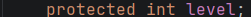
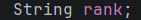
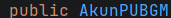
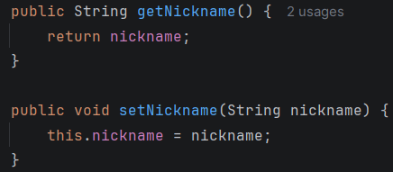
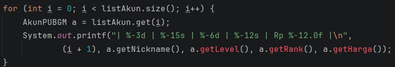
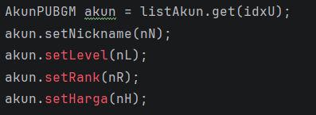
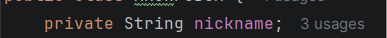

#  LAPORAN POSTTEST 2 - Wonbee Store PUBGM

## 1. Identitas
**Nama:Benyamin Haqie**
**NIM:2409106081**
**Sistem: Penjualan Akun PUBGM Wonbee Store**

---

## 2. Rincian Program
Program ini merupakan aplikasi sederhana untuk manajemen penjualan akun PUBGM yang menggunakan bahasa java. Fokus utama pada posttest kali ini adalah mengimplementasikan penggunaan operasi sistem CRUD (Create, Read, Update, Delete) secara dinamis.

Program ini menggunakan ArrayList sebagai media penyimpanan data akun PUBGM dari class `AkunPUBGM`. Dengan metode Object-Oriented Progamming (OOP), data dapat dikelola secara terstruktur dan juga dapat mudah dikelola karena data akun direpresentasikan sebagai satu objek.
## 3. Fitur Utama
1. **Tambah Akun**: Menambahkan data akun baru ke dalam list.
2. **Lihat Daftar**: Menampilkan data akun dalam format tabel.
3. **Edit Akun**: Mengubah detail informasi akun .
4. **Hapus Akun**: Menghapus stok akun dari list.

---

## 4. Dokumentasi Output Program
- Tampilan Seluruh Menu
  

- Tampilan Menu Add akun
  

- Tampilan Menu Lihat List Akun
  

- Tampilan Menu Edit Akun
  

- Menampilkan Akun Yang Diupdate

- Menu Hapus Akun
- 
- 

- Menu Keluar
- 

## 5. Penjelasan Code by code
**Import Dan Deklarasi Class**

Pada Import disini digunakan untuk mengambil data pada arraylist dan juga sebagai scanner atau pembaca pada input ketikan.

**Main Program**

Main Program merupakan codingan utama yang menghubungkan program ini, yang dimana disinilah kita dapat memilih menu CRUD.

**MenuPilihRank**

Pada fitur program disini tujuannya adalah agar mempermudah pemilihan rank saat memasukkan stok baru pada program aplikasi ini, Tujuannya agar terhindar dari kesalahan pengetikan pada rank.

Pada fitur ini juga terdapat looping yang dimana pada program telah terdapat 8 pilihan rank, jika memilih diluar itu maka program akan mengarahkan agar user memilih rank yang telah tersedia.

**Looping**

Pada program ini Looping di gunakan dari line 33 sampai dengan 119 untuk menu pilihan di menu utama, yang gunanya dia akan terus looping sampai user memilih pilihan 5, yaitu menu keluar program.

**Switch Case**

Fitur ini berfungsi sebagai pengatur pilihan di menu CRUD, yang dimana setiap case akan mengarahkan ke pilihan menu yang beda juga.

## 6. Class Pada Program

Pada program ini saya menggunakan 2 Yaitu :

Class akun PUBGM yang berisi data dan konstruktor.

Class Main yang menjadi tempat semua alur perulangan dan CRUD

## 7. Encapsulation & Access Modifiers

Pada POSTTEST 2 ini saya telah mengimplementasikan 4 access modifier dan juga encapsulation, 4 access modifier adalah :

- **Private** :

  Atribut ini dideklarasikan dengan Access Modifier Private, yang berarti variabel tersebut tidak dapat diakses atau dimodifikasi secara langsung oleh class lain di luar class. Penerapan ini merupakan inti dari konsep Encapsulation, di mana keamanan dan integritas data tetap terjaga karena pengelolaan nilai atribut hanya dapat dilakukan melalui method Getter dan Setter.

- **Protected** :   

  Merupakan modifier yang memberikan aksesibilitas kepada class di dalam package yang sama serta class turunannya. Implementasi ini disiapkan untuk mendukung konsep Inheritance/pewarisan, sehingga kedepannya jika terdapat pengembangan fitur melalui class turunan, atribut ini dapat diakses secara langsung tanpa melanggar prinsip keamanan data.

    
- **Default** :

Merupakan modifier pada atribut yang membatasi aksesibilitas variabel sehingga hanya dapat diakses oleh class-class yang berada di dalam package yang sama. Atribut ini tidak memerlukan kata kunci khusus dalam pendeklarasiannya.

- **Public** :

Berbeda dengan modifier private yang membatasi akses secara ketat, Public Access Modifier memberikan tingkat aksesibilitas paling luas. Atribut ini dideklarasikan agar dapat diakses, dilihat, dan dimodifikasi secara langsung oleh seluruh class manapun, baik yang berada di dalam package yang sama maupun dari luar package secara global. Dalam kasus ini, atribut ini dibiarkan publik untuk mempermudah akses informasi data secara terbuka tanpa harus pakai method.

## 8. Setter dan Getter
Deklarasi Setter Dan Getter :
****

- Setter

  Gambar tersebut menunjukkan implementasi method Setter dalam proses pembaruan data. Karena akses langsung ke atribut telah dibatasi atau Encapsulation, perubahan nilai wajib melalui method ini untuk menjamin keamanan data pada objek.

- Getter

  Gambar di atas menunjukkan penggunaan method Getter untuk mengakses data. Karena atribut kini bersifat private, class Main wajib menggunakan method ini untuk mengambil informasi, sesuai dengan prinsip Encapsulation.

## 9. Inheritence 
Pada Posttest 3 ini, Inheritence diterapkan dengan membuat **AkunPUBGM** sebagai superclass yang melakukan pewarisan atribut umum seperti nickname, level, dan juga rank kepada subclass **AkunGacor** dan **AkunSmurf** menggunakan kata kunci "extends".Penggunaan method Getter di sini membuktikan bahwa meskipun ada hubungan pewarisan, prinsip Encapsulation tetap terjaga karena atribut yang bersifat private pada class induk tidak bisa diakses langsung oleh class Main maupun class anak, sehingga keamanan data tetap terjamin melalui jalur akses method resmi. 
